# Digitakt +Drive Integration - Deep Dive

This document provides a comprehensive, inside-out explanation of how we interact with the Elektron Digitakt device to manage its +Drive file system.

## Table of Contents

1. [High-Level Architecture](#high-level-architecture)
2. [Communication Stack](#communication-stack)
3. [Web MIDI Integration](#web-midi-integration)
4. [SysEx Protocol Deep Dive](#sysex-protocol-deep-dive)
5. [Data Flow & State Management](#data-flow--state-management)
6. [Drive Scanning Process](#drive-scanning-process)
7. [File Operations](#file-operations)
8. [Type System & Data Models](#type-system--data-models)
9. [Message Encoding & Decoding](#message-encoding--decoding)
10. [Complete Request-Response Flow](#complete-request-response-flow)

---

## High-Level Architecture

The Digitakt integration follows a layered architecture, separating concerns between UI, business logic, MIDI communication, and protocol handling.

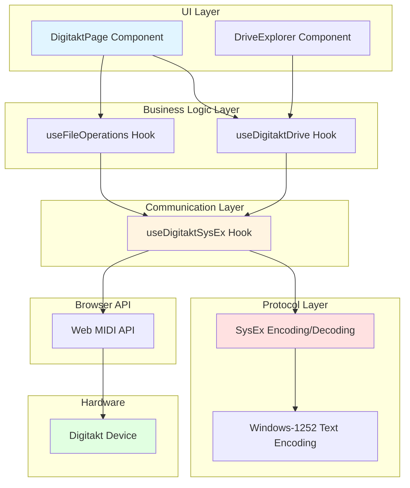
```mermaid
graph TB
    subgraph "UI Layer"
        A[DigitaktPage Component]
        B[DriveExplorer Component]
    end

    subgraph "Business Logic Layer"
        C[useDigitaktDrive Hook]
        D[useFileOperations Hook]
    end

    subgraph "Communication Layer"
        E[useDigitaktSysEx Hook]
    end

    subgraph "Protocol Layer"
        F[SysEx Encoding/Decoding]
        G[Windows-1252 Text Encoding]
    end

    subgraph "Browser API"
        H[Web MIDI API]
    end

    subgraph "Hardware"
        I[Digitakt Device]
    end

    A --> C
    A --> D
    B --> C
    C --> E
    D --> E
    E --> F
    F --> G
    E --> H
    H --> I

    style A fill:#e1f5ff
    style E fill:#fff4e1
    style F fill:#ffe1e1
    style I fill:#e1ffe1
```

### Layer Responsibilities

- **UI Layer**: React components for display and user interaction
- **Business Logic Layer**: Hooks managing drive state and file operations
- **Communication Layer**: MIDI device management and message queuing
- **Protocol Layer**: SysEx message encoding/decoding and data transformation
- **Browser API**: Web MIDI for hardware communication
- **Hardware**: Physical Digitakt device responding to SysEx commands

---

## Communication Stack

### Complete Stack Overview


```mermaid
graph LR
    subgraph "Application Code"
        A[TypeScript Objects]
    end

    subgraph "Message Layer"
        B[ElkMessage Types]
    end

    subgraph "Encoding Layer"
        C[8-bit Byte Arrays]
    end

    subgraph "MIDI Layer"
        D[7-bit SysEx Messages]
    end

    subgraph "Transport Layer"
        E[Web MIDI API]
    end

    subgraph "Hardware Layer"
        F[USB MIDI]
    end

    A <-->|buildMessage/parseMessage| B
    B <-->|serialize/deserialize| C
    C <-->|encode7bit/decode7bit| D
    D <-->|send/receive| E
    E <-->|USB| F
    F <-->|Digitakt| G[Device]

    style A fill:#e1f5ff
    style D fill:#ffe1e1
    style G fill:#e1ffe1
```

### Why 7-bit Encoding?

MIDI is a 7-bit protocol (values 0-127), but our data is 8-bit (values 0-255). We must encode 8-bit data into 7-bit format for transmission.

**Encoding Strategy**: For every 7 bytes of 8-bit data, we create 8 bytes of 7-bit data:
- 1 byte containing the high bits (bit 7) of the next 7 bytes
- 7 bytes containing the low 7 bits of each original byte

```
8-bit data:  [10110101] [11001011] [10101010] ...
             ^^^^^^^^   ^^^^^^^^   ^^^^^^^^
             |      |   |      |   |      |
High bits:   1      1   1      0   1      0  ...
Low 7 bits:  0110101    1001011    0101010 ...

7-bit result: [01110100] [00110101] [01001011] [00101010] ...
              ^^^^^^^^    ^^^^^^^^    ^^^^^^^^    ^^^^^^^^
              hi bits     byte 1      byte 2      byte 3
```

---

## Web MIDI Integration

### MIDI Device Lifecycle

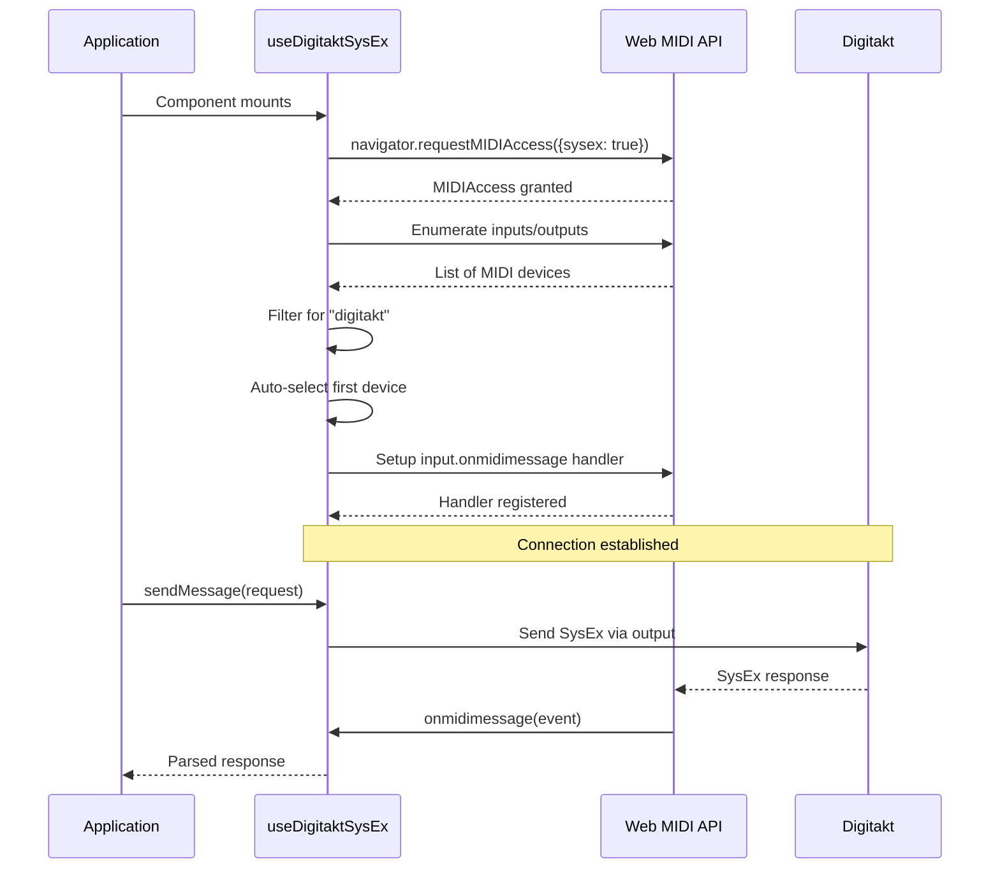
```mermaid
sequenceDiagram
    participant App as Application
    participant Hook as useDigitaktSysEx
    participant API as Web MIDI API
    participant Device as Digitakt

    App->>Hook: Component mounts
    Hook->>API: navigator.requestMIDIAccess({sysex: true})
    API-->>Hook: MIDIAccess granted

    Hook->>API: Enumerate inputs/outputs
    API-->>Hook: List of MIDI devices

    Hook->>Hook: Filter for "digitakt"
    Hook->>Hook: Auto-select first device

    Hook->>API: Setup input.onmidimessage handler
    API-->>Hook: Handler registered

    Note over Hook,Device: Connection established

    App->>Hook: sendMessage(request)
    Hook->>Device: Send SysEx via output
    Device-->>API: SysEx response
    API->>Hook: onmidimessage(event)
    Hook-->>App: Parsed response
```

### Device Detection & Selection

The `useDigitaktSysEx` hook handles MIDI device management:

```typescript
// 1. Request MIDI access with SysEx support
const access = await navigator.requestMIDIAccess({ sysex: true });

// 2. Find Digitakt devices
access.inputs.forEach((input) => {
  if (input.name && input.name.toLowerCase().includes('digitakt')) {
    // Found a Digitakt!
  }
});

// 3. Match input and output by name
const input = findInput('Digitakt');
const output = findOutput('Digitakt');

// 4. Setup message listener
input.onmidimessage = (event: MIDIMessageEvent) => {
  handleMidiMessage(event.data);
};
```

### Message Queue Management

Only one message can be pending at a time to prevent race conditions:

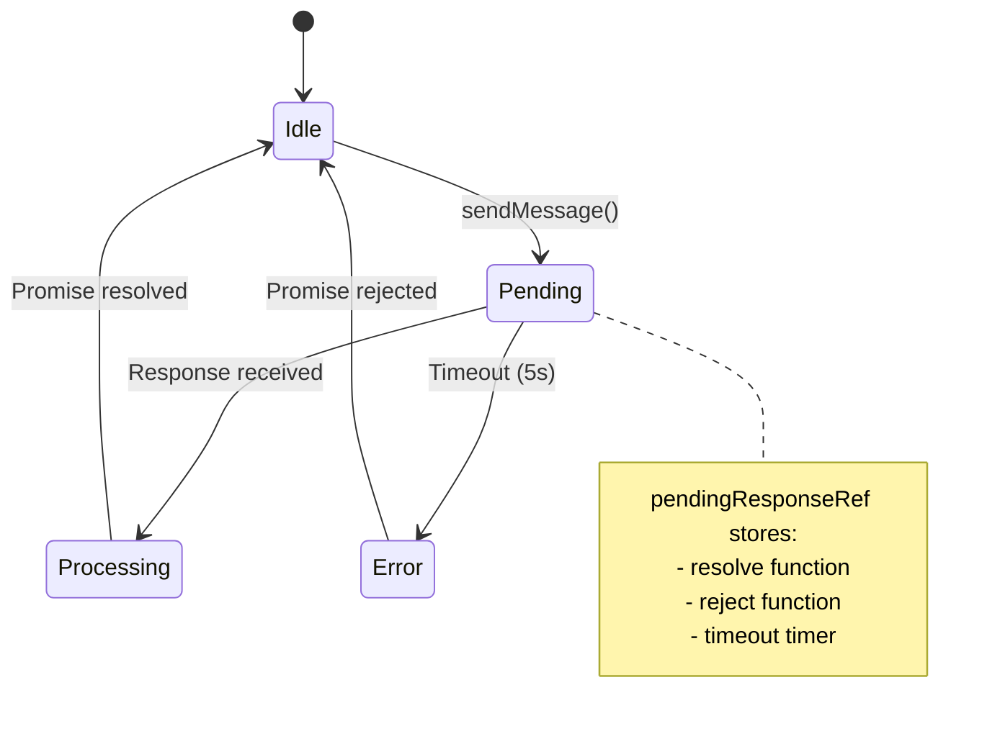
```mermaid
stateDiagram-v2
    [*] --> Idle
    Idle --> Pending: sendMessage()
    Pending --> Processing: Response received
    Processing --> Idle: Promise resolved
    Pending --> Error: Timeout (5s)
    Error --> Idle: Promise rejected

    note right of Pending
        pendingResponseRef stores:
        - resolve function
        - reject function
        - timeout timer
    end note
```

**Code Implementation**:

```typescript
// Global ref to track pending response
const pendingResponseRef = useRef<{
  resolve: (msg: ElkMessage) => void;
  reject: (error: Error) => void;
  timeout: NodeJS.Timeout;
} | null>(null);

async function sendMessage(message: ElkMessage): Promise<ElkMessage> {
  // Prevent concurrent messages
  if (pendingResponseRef.current) {
    throw new Error('Another message is pending');
  }

  return new Promise((resolve, reject) => {
    // Setup timeout
    const timeout = setTimeout(() => {
      pendingResponseRef.current = null;
      reject(new Error('Response timeout'));
    }, 5000);

    // Store promise handlers
    pendingResponseRef.current = { resolve, reject, timeout };

    // Send via MIDI
    const data = buildMessage(message);
    midiOutput.send(data);
  });
}

// When response arrives
function handleMidiMessage(data: Uint8Array) {
  const message = parseMessage(data);

  if (pendingResponseRef.current) {
    clearTimeout(pendingResponseRef.current.timeout);
    pendingResponseRef.current.resolve(message);
    pendingResponseRef.current = null;
  }
}
```

---

## SysEx Protocol Deep Dive

### SysEx Message Structure

Every SysEx message follows this exact structure:

```
┌────────┬─────────┬──────────────┬──────────┬────────┬─────────────────┬────────┐
│  F0    │ 00 20 3C│      10      │    00    │ msgId  │   7-bit data    │   F7   │
│ (Start)│  (Mfr)  │  (Device ID) │  (Sub)   │ respId │   (payload)     │  (End) │
└────────┴─────────┴──────────────┴──────────┴────────┴─────────────────┴────────┘
   1 byte   3 bytes      1 byte      1 byte   4 bytes     variable        1 byte

F0        = SysEx start marker
00 20 3C  = Elektron manufacturer ID
10        = Device ID (0x10 for Digitakt, works for DT1 and DT2)
00        = Sub ID (always 0x00)
msgId     = 16-bit message ID (for matching requests/responses)
respId    = 16-bit response ID (0 for requests, matches msgId for responses)
payload   = 7-bit encoded message data
F7        = SysEx end marker
```

### Message ID and Response ID

The protocol uses a request/response correlation system:

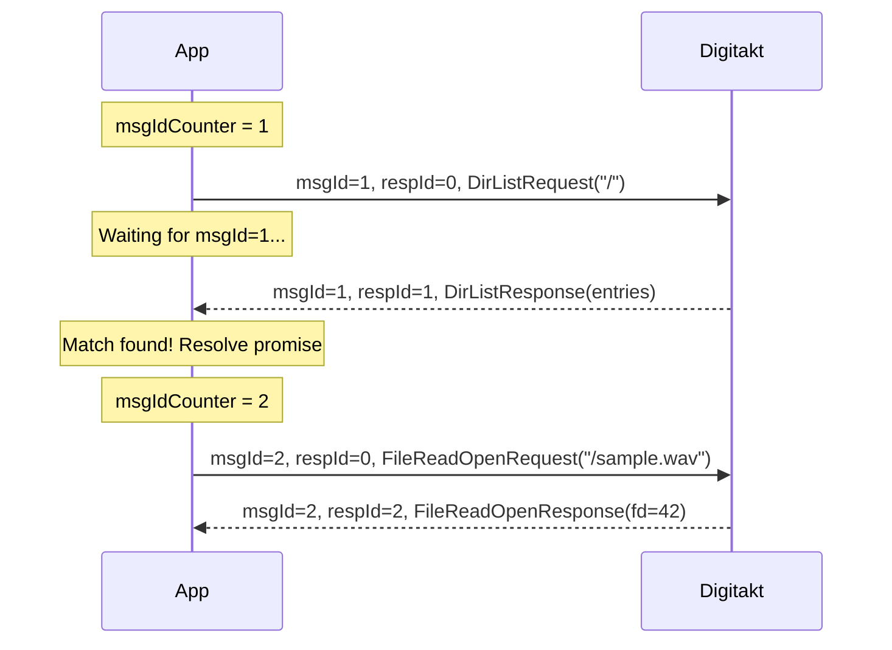
```mermaid
sequenceDiagram
    participant App
    participant Digitakt

    Note over App: msgIdCounter = 1
    App->>Digitakt: msgId=1, respId=0, DirListRequest("/")
    Note over App: Waiting for msgId=1...
    Digitakt-->>App: msgId=1, respId=1, DirListResponse(entries)
    Note over App: Match found! Resolve promise

    Note over App: msgIdCounter = 2
    App->>Digitakt: msgId=2, respId=0, FileReadOpenRequest("/sample.wav")
    Digitakt-->>App: msgId=2, respId=2, FileReadOpenResponse(fd=42)
```

**Key Points**:
- `msgId` increments with each request (1, 2, 3, ...)
- Request messages have `respId = 0`
- Response messages have `respId = msgId` of the request
- This allows matching responses to requests

### Message Types

The protocol supports several message categories:


```mermaid
graph TD
    A[Elektron SysEx Messages] --> B[Device Info 0x0n]
    A --> C[Directory Ops 0x1n]
    A --> D[File Ops 0x2n]
    A --> E[Read Ops 0x3n]
    A --> F[Write Ops 0x4n]

    B --> B1[0x01 DeviceRequest]
    B --> B2[0x02 VersionRequest]

    C --> C1[0x10 DirListRequest]
    C --> C2[0x11 DirCreateRequest]
    C --> C3[0x12 DirDeleteRequest]

    D --> D1[0x20 FileDeleteRequest]
    D --> D2[0x21 ItemRenameRequest]
    D --> D3[0x23 SampleFileInfoRequest]

    E --> E1[0x30 FileReadOpenRequest]
    E --> E2[0x31 FileReadCloseRequest]
    E --> E3[0x32 FileReadRequest]

    F --> F1[0x40 FileWriteOpenRequest]
    F --> F2[0x41 FileWriteCloseRequest]
    F --> F3[0x42 FileWriteRequest]

    style A fill:#e1f5ff
    style B fill:#fff4e1
    style C fill:#ffe1f5
    style D fill:#f5ffe1
    style E fill:#ffe1e1
    style F fill:#e1ffe1
```

Each request has a corresponding response with message ID = request ID + 0x80:
- `0x10` DirListRequest → `0x90` DirListResponse
- `0x30` FileReadOpenRequest → `0xB0` FileReadOpenResponse
- etc.

### Windows-1252 Text Encoding

File and folder names use Windows-1252 encoding (not UTF-8!). This is a superset of ASCII with special characters in the 0x80-0x9F range.

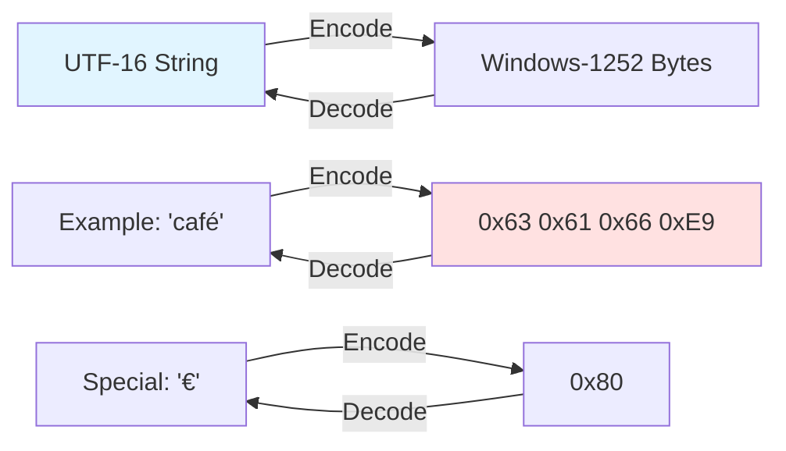
```mermaid
graph LR
    A[UTF-16 String] -->|Encode| B[Windows-1252 Bytes]
    B -->|Decode| A

    C[Example: 'café'] -->|Encode| D[0x63 0x61 0x66 0xE9]
    D -->|Decode| C

    E[Special: '€'] -->|Encode| F[0x80]
    F -->|Decode| E

    style A fill:#e1f5ff
    style D fill:#ffe1e1
```

**Encoding Rules**:
- ASCII characters (0x00-0x7F): Direct mapping
- Latin-1 supplement (0xA0-0xFF): Direct mapping
- Special chars (0x80-0x9F): Use Win-1252 table
- Unsupported characters: Replace with `?` (0x3F)
- Strings are null-terminated (0x00)

**Implementation**:

```typescript
// Encode UTF-16 → Windows-1252
function encodeWin1252(str: string): Uint8Array {
  const bytes: number[] = [];
  for (const char of str) {
    const codePoint = char.charCodeAt(0);
    if (codePoint <= 0x7F || (codePoint >= 0xA0 && codePoint <= 0xFF)) {
      bytes.push(codePoint); // Direct mapping
    } else if (WIN1252_REVERSE_MAP.has(codePoint)) {
      bytes.push(WIN1252_REVERSE_MAP.get(codePoint)!);
    } else {
      bytes.push(0x3F); // '?'
    }
  }
  return new Uint8Array(bytes);
}

// Decode Windows-1252 → UTF-16
function decodeWin1252(bytes: Uint8Array): string {
  const chars: string[] = [];
  for (const byte of bytes) {
    if (byte <= 0x7F || (byte >= 0xA0 && byte <= 0xFF)) {
      chars.push(String.fromCharCode(byte));
    } else if (WIN1252_MAP[byte]) {
      chars.push(String.fromCharCode(WIN1252_MAP[byte]));
    } else {
      chars.push('?');
    }
  }
  return chars.join('');
}
```

---

## Data Flow & State Management

### Component Hierarchy & Data Flow

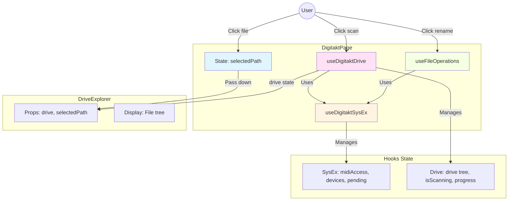
```mermaid
graph TB
    subgraph "DigitaktPage"
        A[State: selectedPath]
        B[useDigitaktSysEx]
        C[useDigitaktDrive]
        D[useFileOperations]
    end

    subgraph "DriveExplorer"
        E[Props: drive, selectedPath]
        F[Display: File tree]
    end

    subgraph "Hooks State"
        G[SysEx: midiAccess, devices, pending]
        H[Drive: drive tree, isScanning, progress]
    end

    A -->|Pass down| E
    C -->|drive state| E
    C -->|Uses| B
    D -->|Uses| B

    B -->|Manages| G
    C -->|Manages| H

    User((User)) -->|Click scan| C
    User -->|Click file| A
    User -->|Click rename| D

    style A fill:#e1f5ff
    style B fill:#fff4e1
    style C fill:#ffe1f5
    style D fill:#f5ffe1
```

### State Management in useDigitaktDrive

The drive state is immutable and updated atomically after each operation:

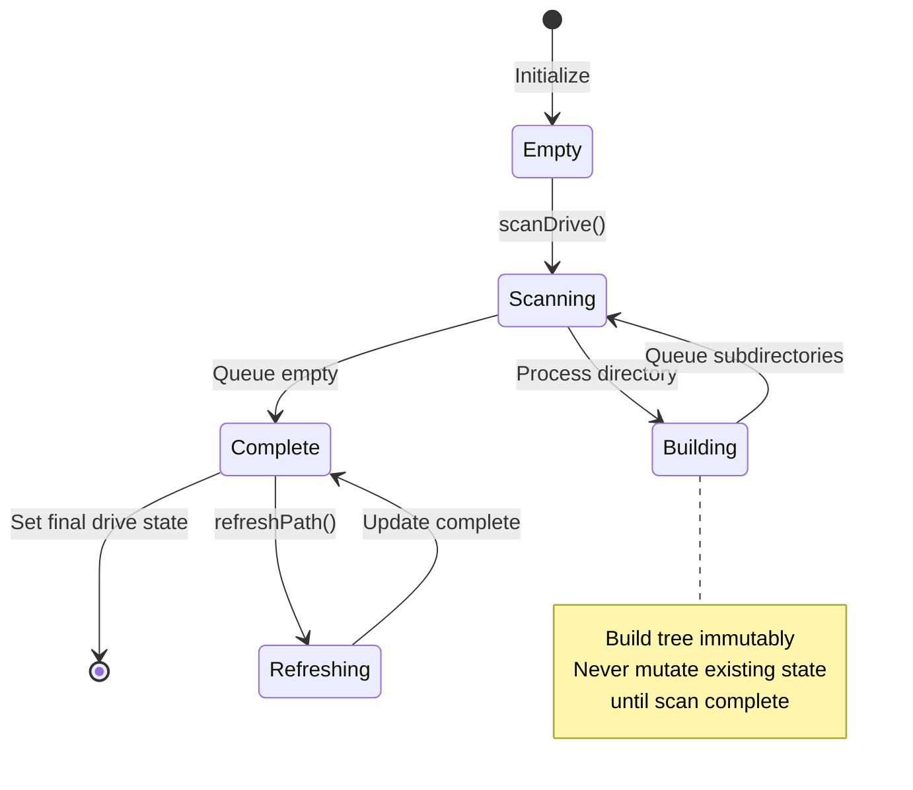
```mermaid
stateDiagram-v2
    [*] --> Empty: Initialize
    Empty --> Scanning: scanDrive()
    Scanning --> Building: Process directory
    Building --> Scanning: Queue subdirectories
    Scanning --> Complete: Queue empty
    Complete --> [*]: Set final drive state

    Complete --> Refreshing: refreshPath()
    Refreshing --> Complete: Update complete

    note right of Building
        Build tree immutably
        Never mutate existing state
        until scan complete
    end note
```

**Key Principle**: The drive tree is built in a local variable during scanning and only set to React state once at the end. This prevents unnecessary re-renders.

```typescript
const scanDrive = async () => {
  let currentDrive: Drive = emptyDrive(); // Local, mutable variable
  const queue: Path[] = [ROOT_PATH];

  while (queue.length > 0) {
    const path = queue.shift()!;

    // Request directory listing
    const response = await sysex.sendMessage({
      type: 'DirListRequest',
      path: pathToString(path),
    });

    // Merge entries into local drive (immutably)
    const { drive: updatedDrive, dirsToScan } = mergeEntries(
      path,
      response.entries,
      currentDrive
    );

    currentDrive = updatedDrive; // Update local variable
    queue.push(...dirsToScan);   // Queue subdirectories

    // Update progress only (not drive state)
    setScanProgress(percentage);
  }

  // Set final state once
  setDrive(currentDrive);
};
```

---

## Drive Scanning Process

### Breadth-First Directory Traversal

The drive scanner uses a breadth-first approach with a queue to traverse the directory tree:

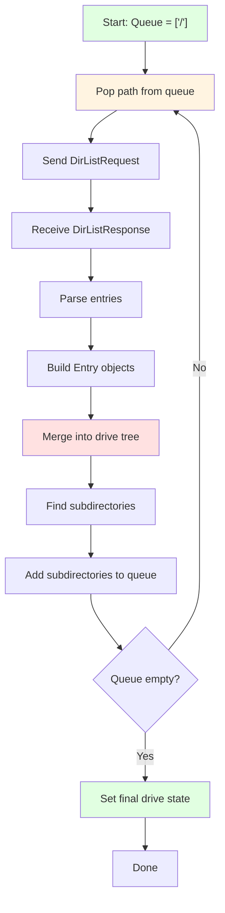
```mermaid
graph TB
    A["Start: Queue = ['/']"] --> B[Pop path from queue]
    B --> C[Send DirListRequest]
    C --> D[Receive DirListResponse]
    D --> E[Parse entries]
    E --> F[Build Entry objects]
    F --> G[Merge into drive tree]
    G --> H[Find subdirectories]
    H --> I[Add subdirectories to queue]
    I --> J{Queue empty?}
    J -->|No| B
    J -->|Yes| K[Set final drive state]
    K --> L[Done]

    style A fill:#e1ffe1
    style K fill:#e1ffe1
    style B fill:#fff4e1
    style G fill:#ffe1e1
```

### Detailed Scan Example

Let's trace a scan of this directory structure:

```
/
├── FACTORY/
│   └── kick.wav
├── samples/
│   ├── drums/
│   │   └── snare.wav
│   └── bass.wav
└── TRASH/
```

**Scan Sequence**:

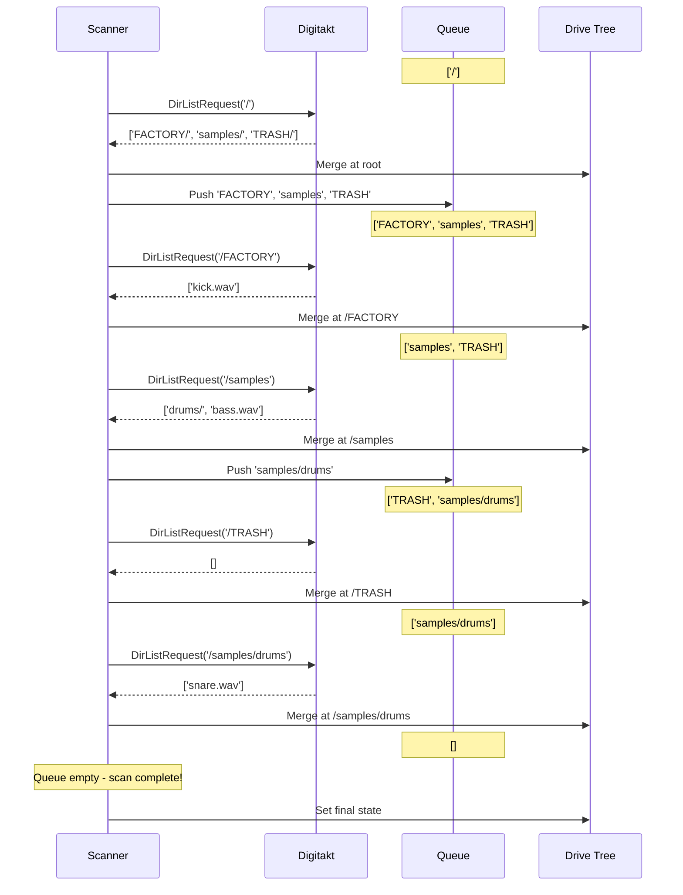
```mermaid
sequenceDiagram
    participant S as Scanner
    participant D as Digitakt
    participant Q as Queue
    participant T as Drive Tree

    Note over Q: ['/']
    S->>D: DirListRequest('/')
    D-->>S: ['FACTORY/', 'samples/', 'TRASH/']
    S->>T: Merge at root
    S->>Q: Push 'FACTORY', 'samples', 'TRASH'
    Note over Q: ['FACTORY', 'samples', 'TRASH']

    S->>D: DirListRequest('/FACTORY')
    D-->>S: ['kick.wav']
    S->>T: Merge at /FACTORY
    Note over Q: ['samples', 'TRASH']

    S->>D: DirListRequest('/samples')
    D-->>S: ['drums/', 'bass.wav']
    S->>T: Merge at /samples
    S->>Q: Push 'samples/drums'
    Note over Q: ['TRASH', 'samples/drums']

    S->>D: DirListRequest('/TRASH')
    D-->>S: []
    S->>T: Merge at /TRASH
    Note over Q: ['samples/drums']

    S->>D: DirListRequest('/samples/drums')
    D-->>S: ['snare.wav']
    S->>T: Merge at /samples/drums
    Note over Q: []

    Note over S: Queue empty - scan complete!
    S->>T: Set final state
```

### Immutable Tree Updates

When merging entries, we must rebuild the tree path immutably:

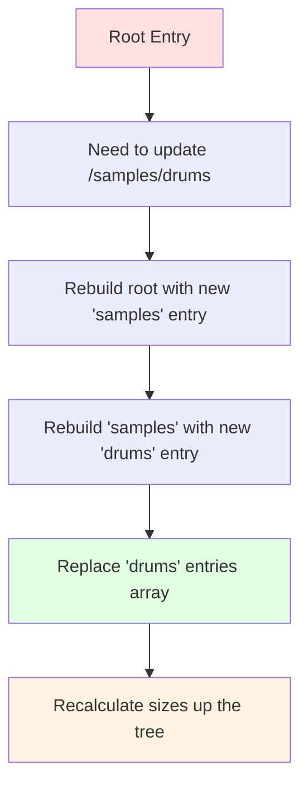
```mermaid
graph TB
    A[Root Entry] --> B[Need to update /samples/drums]
    B --> C[Rebuild root with new 'samples' entry]
    C --> D[Rebuild 'samples' with new 'drums' entry]
    D --> E[Replace 'drums' entries array]
    E --> F[Recalculate sizes up the tree]

    style A fill:#ffe1e1
    style E fill:#e1ffe1
    style F fill:#fff4e1
```

**Code**:

```typescript
function updateAtPath(
  entry: Entry,
  targetPath: Path,
  newEntries: Entry[],
  depth: number = 0
): Entry {
  // Reached target - replace entries
  if (depth === targetPath.length) {
    if (entry.item.kind === 'directory') {
      const totalSize = newEntries.reduce((sum, e) => sum + e.itemSize, 0);
      return {
        ...entry,
        item: { kind: 'directory', entries: newEntries },
        itemSize: totalSize,
      };
    }
  }

  // Recurse into child
  if (entry.item.kind === 'directory') {
    const targetName = targetPath[depth];
    const updatedEntries = entry.item.entries.map((child) =>
      child.name === targetName
        ? updateAtPath(child, targetPath, newEntries, depth + 1)
        : child
    );

    // Recalculate size
    const totalSize = updatedEntries.reduce((sum, e) => sum + e.itemSize, 0);

    return {
      ...entry,
      item: { kind: 'directory', entries: updatedEntries },
      itemSize: totalSize,
    };
  }

  return entry;
}
```

### Progress Tracking

Progress is calculated as the ratio of scanned directories to total known directories:

```
progress = scanned / (scanned + queue.length) * 100
```

This gives an estimate but may not be perfectly linear since we discover new directories as we scan.

---

## File Operations

### Create Directory Flow

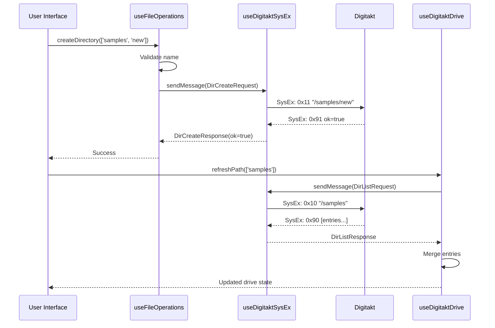
```mermaid
sequenceDiagram
    participant UI as User Interface
    participant FO as useFileOperations
    participant SX as useDigitaktSysEx
    participant DT as Digitakt
    participant DR as useDigitaktDrive

    UI->>FO: createDirectory(['samples', 'new'])
    FO->>FO: Validate name
    FO->>SX: sendMessage(DirCreateRequest)
    SX->>DT: SysEx: 0x11 "/samples/new"
    DT-->>SX: SysEx: 0x91 ok=true
    SX-->>FO: DirCreateResponse(ok=true)
    FO-->>UI: Success
    UI->>DR: refreshPath(['samples'])
    DR->>SX: sendMessage(DirListRequest)
    SX->>DT: SysEx: 0x10 "/samples"
    DT-->>SX: SysEx: 0x90 [entries...]
    SX-->>DR: DirListResponse
    DR->>DR: Merge entries
    DR-->>UI: Updated drive state
```

### Rename Item Flow

Renaming uses the `ItemRenameRequest` which works for both files and directories:

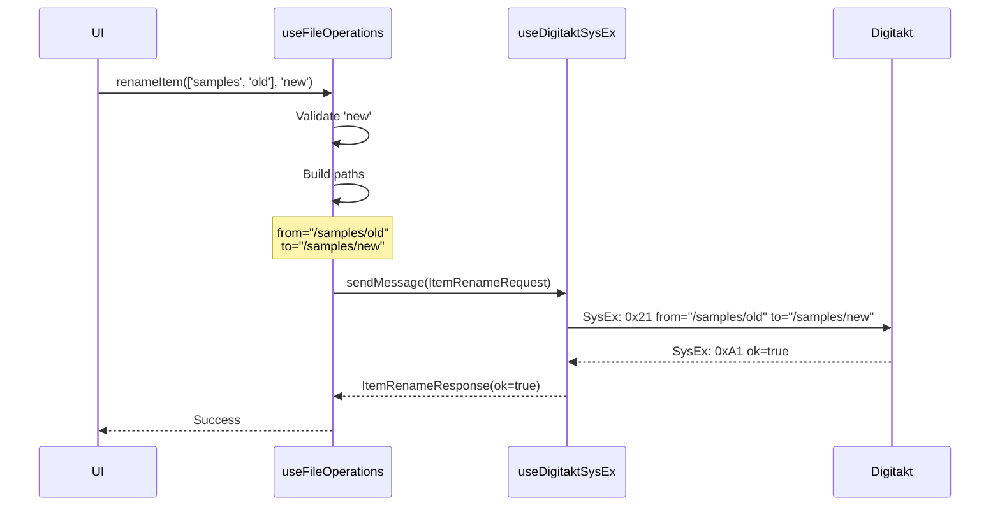
```mermaid
sequenceDiagram
    participant UI
    participant FO as useFileOperations
    participant SX as useDigitaktSysEx
    participant DT as Digitakt

    UI->>FO: renameItem(['samples', 'old'], 'new')
    FO->>FO: Validate 'new'
    FO->>FO: Build paths
    Note over FO: from="/samples/old"<br/>to="/samples/new"

    FO->>SX: sendMessage(ItemRenameRequest)
    SX->>DT: SysEx: 0x21 from="/samples/old" to="/samples/new"
    DT-->>SX: SysEx: 0xA1 ok=true
    SX-->>FO: ItemRenameResponse(ok=true)
    FO-->>UI: Success
```

### Move to Trash Flow

Moving to trash is implemented as a rename to `/TRASH/[name]`:

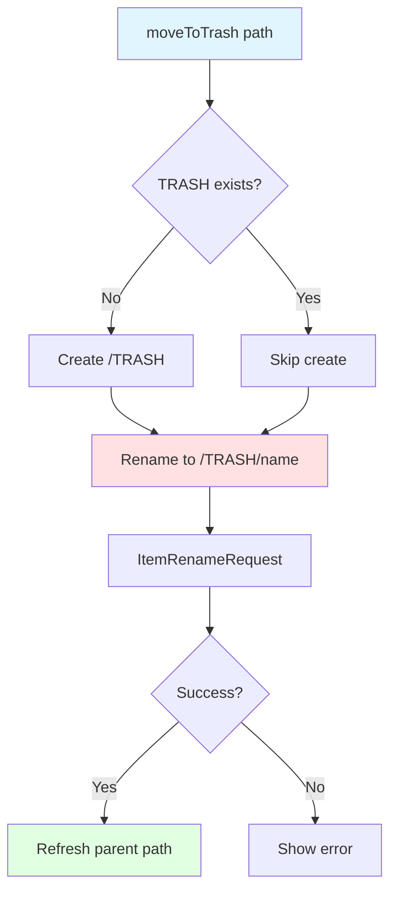
```mermaid
graph TB
    A[moveToTrash path] --> B{TRASH exists?}
    B -->|No| C[Create /TRASH]
    B -->|Yes| D[Skip create]
    C --> E[Rename to /TRASH/name]
    D --> E
    E --> F[ItemRenameRequest]
    F --> G{Success?}
    G -->|Yes| H[Refresh parent path]
    G -->|No| I[Show error]

    style A fill:#e1f5ff
    style E fill:#ffe1e1
    style H fill:#e1ffe1
```

### Empty Trash Flow

Emptying trash requires depth-first deletion (files before their parent directories):

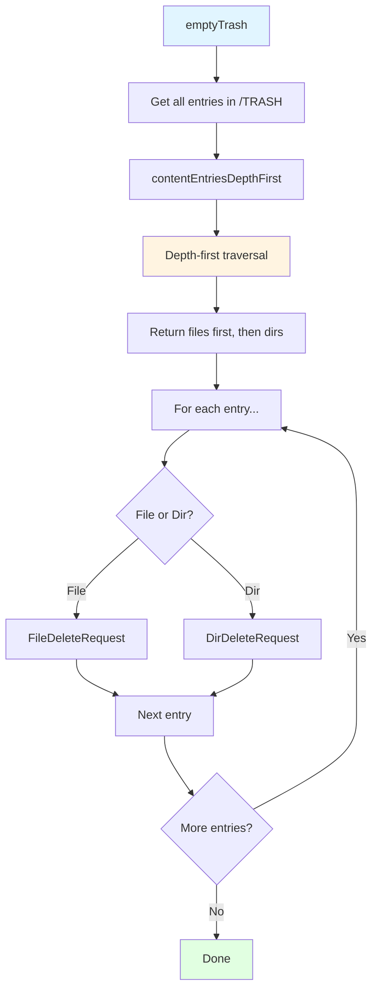
```mermaid
graph TB
    A[emptyTrash] --> B[Get all entries in /TRASH]
    B --> C[contentEntriesDepthFirst]
    C --> D[Depth-first traversal]
    D --> E[Return files first, then dirs]
    E --> F[For each entry...]
    F --> G{File or Dir?}
    G -->|File| H[FileDeleteRequest]
    G -->|Dir| I[DirDeleteRequest]
    H --> J[Next entry]
    I --> J
    J --> K{More entries?}
    K -->|Yes| F
    K -->|No| L[Done]

    style A fill:#e1f5ff
    style D fill:#fff4e1
    style L fill:#e1ffe1
```

**Why depth-first?** Directories can only be deleted when empty, so we must delete all files and subdirectories first.

**Example**:
```
/TRASH
├── folder/
│   ├── file1.wav
│   └── file2.wav
└── file3.wav

Deletion order:
1. /TRASH/folder/file1.wav (file)
2. /TRASH/folder/file2.wav (file)
3. /TRASH/folder (directory, now empty)
4. /TRASH/file3.wav (file)
```

---

## Type System & Data Models

### Path Representation

Paths are represented as arrays of strings, not single strings:

```typescript
type Path = string[];

// Examples:
const root: Path = [];                    // '/'
const samples: Path = ['samples'];        // '/samples'
const kick: Path = ['samples', 'kick.wav']; // '/samples/kick.wav'
```

**Why arrays?**
- Easy to navigate parent/child relationships
- No string parsing needed
- Type-safe manipulation

```typescript
// Get parent
function dirPath(path: Path): Path {
  return path.slice(0, -1);
}

// Get basename
function baseName(path: Path): string {
  return path[path.length - 1];
}

// Append to path
function subPath(path: Path, name: string): Path {
  return [...path, name];
}
```

### Entry and Item Types

The drive tree uses a recursive structure:

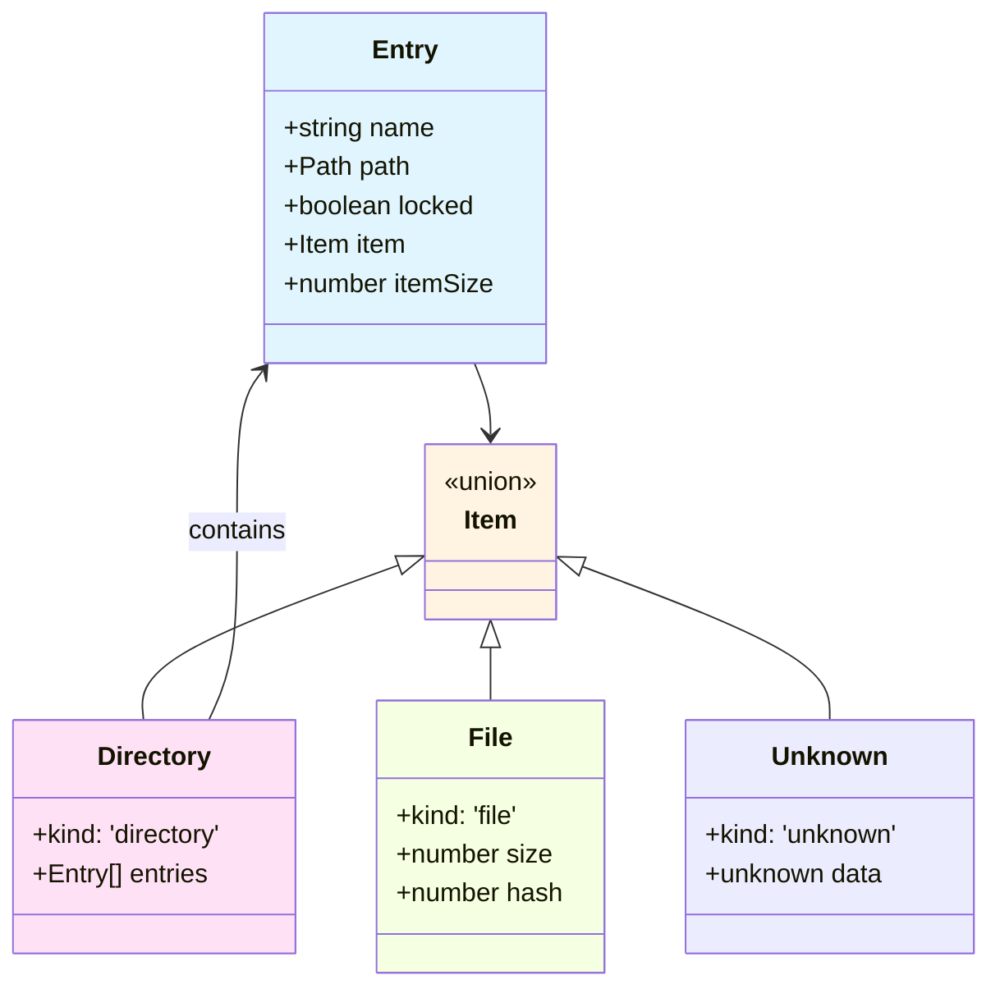
```mermaid
classDiagram
    class Entry {
        +string name
        +Path path
        +boolean locked
        +Item item
        +number itemSize
    }

    class Item {
        <<union>>
    }

    class Directory {
        +kind: 'directory'
        +Entry[] entries
    }

    class File {
        +kind: 'file'
        +number size
        +number hash
    }

    class Unknown {
        +kind: 'unknown'
        +unknown data
    }

    Entry --> Item
    Item <|-- Directory
    Item <|-- File
    Item <|-- Unknown
    Directory --> Entry : contains

    style Entry fill:#e1f5ff
    style Item fill:#fff4e1
    style Directory fill:#ffe1f5
    style File fill:#f5ffe1
```

**TypeScript Definitions**:

```typescript
type Item =
  | { kind: 'directory'; entries: Entry[] }
  | { kind: 'file'; size: number; hash: number }
  | { kind: 'unknown'; data: unknown };

interface Entry {
  name: string;       // File/folder name
  path: Path;         // Full path as array
  locked: boolean;    // Lock flag from device
  item: Item;         // Type-specific data
  itemSize: number;   // Total size (for dirs: sum of contents)
}

interface Drive {
  root: Entry;  // The root entry (path = [])
}
```

### DirEntry vs Entry

`DirEntry` is the raw response from the Digitakt, while `Entry` is our internal representation:

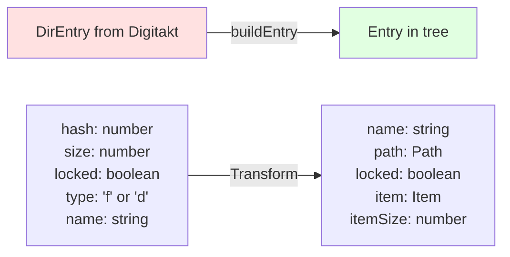
```mermaid
graph LR
    A[DirEntry from Digitakt] -->|buildEntry| B[Entry in tree]

    C[hash: number<br/>size: number<br/>locked: boolean<br/>type: 'f' or 'd'<br/>name: string] -->|Transform| D[name: string<br/>path: Path<br/>locked: boolean<br/>item: Item<br/>itemSize: number]

    style A fill:#ffe1e1
    style B fill:#e1ffe1
```

**Transformation**:

```typescript
function buildEntry(dirEntry: DirEntry, parentPath: Path): Entry {
  const entryPath = [...parentPath, dirEntry.name];

  const item: Item =
    dirEntry.type === 'd'
      ? { kind: 'directory', entries: [] }
      : { kind: 'file', size: dirEntry.size, hash: dirEntry.hash };

  return {
    name: dirEntry.name,
    path: entryPath,
    locked: dirEntry.locked,
    item,
    itemSize: dirEntry.type === 'd' ? 0 : dirEntry.size,
  };
}
```

---

## Message Encoding & Decoding

### Building a Message

Let's trace building a `DirListRequest` for `/samples`:

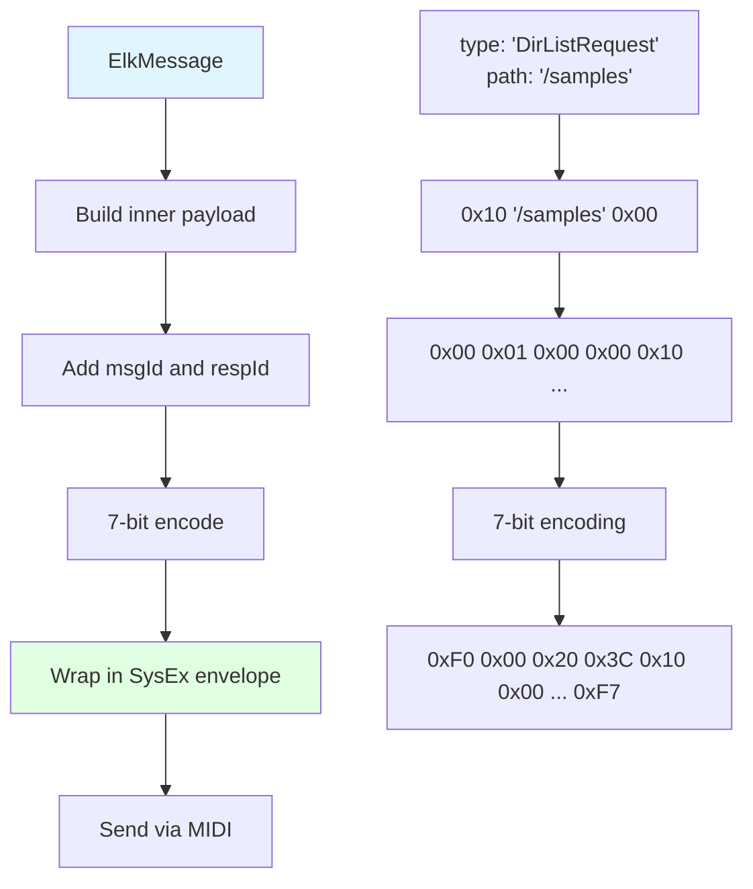
```mermaid
graph TB
    A[ElkMessage] --> B[Build inner payload]
    B --> C[Add msgId and respId]
    C --> D[7-bit encode]
    D --> E[Wrap in SysEx envelope]
    E --> F[Send via MIDI]

    A1["type: 'DirListRequest'<br/>path: '/samples'"] --> B1[0x10 '/samples' 0x00]
    B1 --> C1[0x00 0x01 0x00 0x00 0x10 ...]
    C1 --> D1[7-bit encoding]
    D1 --> E1[0xF0 0x00 0x20 0x3C 0x10 0x00 ... 0xF7]

    style A fill:#e1f5ff
    style E fill:#e1ffe1
```

**Step-by-step**:

1. **Inner payload** (message-specific):
```typescript
// For DirListRequest
const innerPayload = [
  0x10,                           // Message ID
  ...buildString0Win1252(path),   // Path as Win-1252 + null
];
// Result: [0x10, 0x2F, 0x73, 0x61, 0x6D, 0x70, 0x6C, 0x65, 0x73, 0x00]
//          ^^^^  ^^^^  ^^^^  ^^^^  ^^^^  ^^^^  ^^^^  ^^^^  ^^^^  ^^^^
//          0x10   '/'   's'   'a'   'm'   'p'   'l'   'e'   's'  '\0'
```

2. **Add message envelope**:
```typescript
// msgId increments globally: 1, 2, 3, ...
const msgId = messageIdCounter++; // e.g., 1
const fullPayload = [
  ...buildUint16BE(msgId),  // [0x00, 0x01]
  ...buildUint16BE(0),      // [0x00, 0x00] - respId always 0 for requests
  ...innerPayload,
];
// Result: [0x00, 0x01, 0x00, 0x00, 0x10, 0x2F, 0x73, ...]
```

3. **7-bit encode**:
```typescript
// Converts 8-bit bytes to 7-bit MIDI-safe bytes
const encoded = encode7bit(fullPayload);
```

4. **Wrap in SysEx**:
```typescript
const sysex = new Uint8Array([
  0xF0,                          // Start
  0x00, 0x20, 0x3C,             // Elektron manufacturer ID
  0x10,                          // Device ID (Digitakt)
  0x00,                          // Sub ID
  ...encoded,                    // 7-bit payload
  0xF7,                          // End
]);
```

### Parsing a Response

Parsing reverses the encoding process:

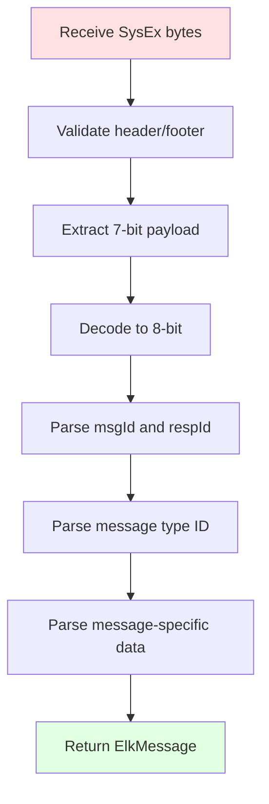
```mermaid
graph TB
    A[Receive SysEx bytes] --> B[Validate header/footer]
    B --> C[Extract 7-bit payload]
    C --> D[Decode to 8-bit]
    D --> E[Parse msgId and respId]
    E --> F[Parse message type ID]
    F --> G[Parse message-specific data]
    G --> H[Return ElkMessage]

    style A fill:#ffe1e1
    style H fill:#e1ffe1
```

**Example - DirListResponse**:

```typescript
// 1. Unwrap SysEx
const payload = unwrapSysEx(data);
// payload is now 8-bit data (7-bit decoded)

// 2. Parse envelope
const parser = new ByteParser(payload);
const msgId = parser.uint16BE();    // Match with request
const respId = parser.uint16BE();   // Should equal msgId
const messageType = parser.byte();  // 0x90 for DirListResponse

// 3. Parse message-specific data
const entries: DirEntry[] = [];
while (parser.hasMore()) {
  const hash = parser.uint32BE();
  const size = parser.uint32BE();
  const locked = parser.bool();
  const typeByte = parser.byte();
  const type = typeByte === 0x44 ? 'd' : 'f'; // 'D' or 'F'
  const name = parser.string0Win1252();

  entries.push({ hash, size, locked, type, name });
}

return { type: 'DirListResponse', entries };
```

### ByteParser Helper

The `ByteParser` class provides convenient methods for reading binary data:

```typescript
class ByteParser {
  private offset = 0;

  constructor(private data: Uint8Array) {}

  byte(): number {
    return this.data[this.offset++];
  }

  bool(): boolean {
    const b = this.byte();
    return b === 0x01; // 0x00 = false, 0x01 = true
  }

  uint32BE(): number {
    const b0 = this.byte();
    const b1 = this.byte();
    const b2 = this.byte();
    const b3 = this.byte();
    return (b0 << 24) | (b1 << 16) | (b2 << 8) | b3;
  }

  string0Win1252(): string {
    const bytes: number[] = [];
    while (this.offset < this.data.length) {
      const b = this.byte();
      if (b === 0x00) break; // Null terminator
      bytes.push(b);
    }
    return decodeWin1252(new Uint8Array(bytes));
  }

  rest(): Uint8Array {
    return this.data.slice(this.offset);
  }
}
```

---

## Complete Request-Response Flow

### Directory Listing Example

Let's trace a complete directory listing request from UI click to state update:

```mermaid
sequenceDiagram
    participant User
    participant UI as DigitaktPage
    participant DriveHook as useDigitaktDrive
    participant SysExHook as useDigitaktSysEx
    participant MIDIOut as MIDI Output
    participant Device as Digitakt
    participant MIDIIn as MIDI Input

    User->>UI: Click "Scan +Drive"
    UI->>DriveHook: scanDrive()

    Note over DriveHook: Initialize scan
    DriveHook->>DriveHook: setIsScanning(true)
    DriveHook->>DriveHook: queue = ['/']

    DriveHook->>SysExHook: sendMessage(DirListRequest('/'))

    Note over SysExHook: Build message
    SysExHook->>SysExHook: msgId = 1, respId = 0
    SysExHook->>SysExHook: payload = [0x10, 0x2F, 0x00]
    SysExHook->>SysExHook: encode7bit(payload)
    SysExHook->>SysExHook: wrapSysEx(encoded)

    Note over SysExHook: Setup promise
    SysExHook->>SysExHook: pendingResponseRef = {resolve, reject, timeout}

    SysExHook->>MIDIOut: send(sysex)
    MIDIOut->>Device: USB MIDI SysEx

    Note over Device: Process request<br/>Read directory<br/>Build response

    Device->>MIDIIn: USB MIDI SysEx
    MIDIIn->>SysExHook: onmidimessage(event)

    Note over SysExHook: Parse response
    SysExHook->>SysExHook: unwrapSysEx(data)
    SysExHook->>SysExHook: decode7bit(payload)
    SysExHook->>SysExHook: parseMessage(bytes)
    SysExHook->>SysExHook: msgId matches!
    SysExHook->>SysExHook: clearTimeout()
    SysExHook->>SysExHook: resolve(message)

    SysExHook-->>DriveHook: DirListResponse({entries: [...]})

    Note over DriveHook: Process entries
    DriveHook->>DriveHook: mergeEntries('/', entries, drive)
    DriveHook->>DriveHook: Build Entry objects
    DriveHook->>DriveHook: Update tree immutably
    DriveHook->>DriveHook: Extract subdirectories
    DriveHook->>DriveHook: queue.push(...subdirs)

    Note over DriveHook: Continue scanning...<br/>Repeat for each directory

    DriveHook->>DriveHook: Queue empty
    DriveHook->>DriveHook: setDrive(finalDrive)
    DriveHook->>DriveHook: setIsScanning(false)

    DriveHook-->>UI: Drive state updated
    UI-->>User: Display file tree
```

### File Read Example (Bonus)

Reading a file involves multiple request-response pairs:

```mermaid
sequenceDiagram
    participant App
    participant DT as Digitakt

    App->>DT: FileReadOpenRequest("/sample.wav")
    DT-->>App: FileReadOpenResponse(fd=42, totalLen=44100)

    Note over App: File is 44100 bytes<br/>Chunk size is 512 bytes<br/>Need 87 chunks

    loop For each chunk
        App->>DT: FileReadRequest(fd=42, chunkLen=512, chunkStart=0)
        DT-->>App: FileReadResponse(data=[512 bytes])
        Note over App: Append to buffer

        App->>DT: FileReadRequest(fd=42, chunkLen=512, chunkStart=512)
        DT-->>App: FileReadResponse(data=[512 bytes])
        Note over App: Append to buffer

        Note over App: ... 85 more chunks ...
    end

    App->>DT: FileReadRequest(fd=42, chunkLen=300, chunkStart=43800)
    DT-->>App: FileReadResponse(data=[300 bytes])
    Note over App: Final chunk

    App->>DT: FileReadCloseRequest(fd=42)
    DT-->>App: FileReadCloseResponse(fd=42, totalLen=44100)

    Note over App: File complete!<br/>44100 bytes received
```

---

## Architecture Patterns & Best Practices

### Hook Composition

The codebase uses hook composition for separation of concerns:

```mermaid
graph TB
    subgraph "Low-level"
        A[useDigitaktSysEx]
    end

    subgraph "Mid-level"
        B[useDigitaktDrive]
        C[useFileOperations]
    end

    subgraph "High-level"
        D[DigitaktPage]
    end

    D --> B
    D --> C
    B --> A
    C --> A

    A -->|Concern| A1[MIDI communication<br/>Device management<br/>Message queue]
    B -->|Concern| B1[Drive state<br/>Tree building<br/>Scanning logic]
    C -->|Concern| C1[File operations<br/>Validation<br/>Error handling]

    style A fill:#ffe1e1
    style B fill:#fff4e1
    style C fill:#f5ffe1
    style D fill:#e1f5ff
```

### Immutable State Updates

All state updates maintain immutability:

```typescript
// ✅ Good - creates new objects
const updatedEntry = {
  ...entry,
  item: { ...entry.item, entries: newEntries },
};

// ❌ Bad - mutates existing object
entry.item.entries = newEntries;
```

### Error Handling

Errors propagate up through the hook chain:

```mermaid
graph BT
    A[MIDI Error] -->|throw| B[useDigitaktSysEx]
    B -->|Promise.reject| C[useDigitaktDrive]
    C -->|catch| D[Set error state]
    D -->|Display| E[UI Error Banner]

    F[Timeout] -->|throw| B
    G[Parse Error] -->|throw| B
    H[Device Error] -->|throw| B

    style A fill:#ffe1e1
    style F fill:#ffe1e1
    style G fill:#ffe1e1
    style H fill:#ffe1e1
```

### Performance Optimizations

1. **Batch State Updates**: Only update drive state once after complete scan
2. **Progress Throttling**: Update progress only on each directory (not file)
3. **Memoization**: Use `useCallback` to prevent recreating functions
4. **Lazy Initialization**: Only scan when user requests

---

## Common Patterns

### Creating a New Request Type

To add a new message type:

1. **Add to type definition** (`types/sysex.ts`):
```typescript
export type ElkMessage =
  | ... existing types ...
  | { type: 'MyNewRequest'; param: string }
  | { type: 'MyNewResponse'; result: number };

export const MessageId = {
  ... existing IDs ...
  MyNewRequest: 0x50,
  MyNewResponse: 0xD0,
};
```

2. **Add builder** (`utils/sysex.ts`):
```typescript
case 'MyNewRequest':
  innerPayload.push(
    MessageId.MyNewRequest,
    ...buildString0Win1252(msg.param)
  );
  break;
```

3. **Add parser** (`utils/sysex.ts`):
```typescript
case MessageId.MyNewResponse: {
  const result = parser.uint32BE();
  return { type: 'MyNewResponse', result };
}
```

4. **Use in hook**:
```typescript
const response = await sysex.sendMessage({
  type: 'MyNewRequest',
  param: 'test',
});

if (response.type === 'MyNewResponse') {
  console.log(response.result);
}
```

### Path Manipulation

```typescript
import { pathToString, subPath, baseName, dirPath } from '../utils/pathUtils';

// Build path
const samplesPath = ['samples'];
const kickPath = subPath(samplesPath, 'kick.wav'); // ['samples', 'kick.wav']

// Convert to string
const pathStr = pathToString(kickPath); // '/samples/kick.wav'

// Get components
const name = baseName(kickPath);  // 'kick.wav'
const parent = dirPath(kickPath); // ['samples']
```

---

## Debugging Tips

### Enable Verbose Logging

The code has console.log statements at key points:

```typescript
// In useDigitaktSysEx.ts
console.log(`Connected to Digitakt: ${selectedDevice}`);

// In useDigitaktDrive.ts
console.log(`Refreshing path: ${pathStr}`);
console.log(`Path refreshed: ${pathStr}`);

// In useFileOperations.ts
console.log(`Creating directory: ${pathStr}`);
console.log(`Directory created: ${pathStr}`);
```

### Inspect MIDI Messages

Use browser DevTools to log raw MIDI data:

```typescript
input.onmidimessage = (event: MIDIMessageEvent) => {
  console.log('Raw MIDI:', Array.from(event.data).map(b =>
    '0x' + b.toString(16).padStart(2, '0')
  ).join(' '));
  handleMidiMessage(event.data);
};
```

### Common Issues

1. **"No MIDI output available"**:
   - Check USB connection
   - Verify device is powered on
   - Check browser supports Web MIDI (Chrome, Edge - not Firefox)

2. **"Response timeout"**:
   - Device may be busy
   - Check USB cable
   - Try reconnecting device

3. **Invalid encoding errors**:
   - Check for special characters in file names
   - Verify Windows-1252 encoding

4. **Drive tree not updating**:
   - Check immutability of updates
   - Verify state is set after scan completes
   - Look for mutations in mergeEntries

---

## References

- **elk-herd**: Original Elm implementation - https://github.com/mxmxmx/elk-herd
- **Web MIDI API**: https://developer.mozilla.org/en-US/docs/Web/API/Web_MIDI_API
- **Elektron Documentation**: Official Digitakt manual
- **Windows-1252 Encoding**: https://en.wikipedia.org/wiki/Windows-1252
- **MIDI Specification**: https://www.midi.org/specifications

---

## Summary

The Digitakt integration is built on these key concepts:

1. **Layered Architecture**: Clear separation between UI, business logic, communication, and protocol
2. **Web MIDI API**: Browser-native USB MIDI communication
3. **SysEx Protocol**: Custom binary protocol with 7-bit encoding
4. **Immutable State**: React-friendly state management with atomic updates
5. **Type Safety**: Comprehensive TypeScript types for all data structures
6. **Queue-based Scanning**: Breadth-first directory traversal
7. **Request-Response Correlation**: Message ID matching for async operations

The implementation closely follows the elk-herd protocol specification while adapting it to modern React patterns and TypeScript type safety.
